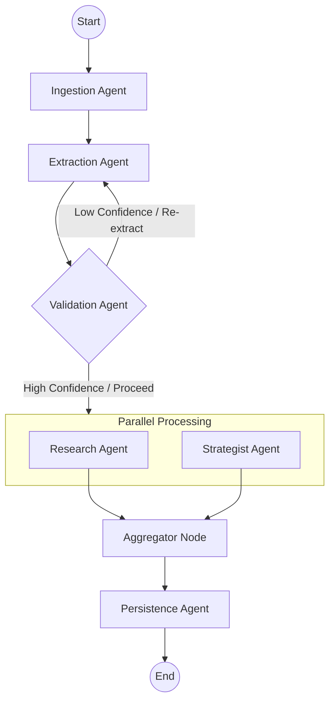

# Nyayodhaya LangGraph Swarm Architecture

This document outlines the transition from a sequential pipeline to a multi-agent swarm architecture using **LangGraph**. This design enables robust handling of unstructured legal PDFs through specialized, collaborative agents.

## 1. Core Concept: The Swarm

Instead of a linear flow, we employ a **State Graph** where multiple agents operate on a shared `AgentState` object. Each agent is specialized in a specific domain of legal document processing, fostering a collaborative and adaptive system for document analysis.

### The Swarm Agents

The following table details the responsibilities and key capabilities of each agent within the LangGraph swarm:

| Agent | Responsibility | Key Capability |
| :--- | :--- | :--- |
| **Ingestion Agent** | PDF Parsing & OCR | Handles unstructured data, performs layout analysis, and extracts text. It identifies if a PDF is scanned or text-based and prepares the content for further processing. |
| **Extraction Agent** | Legal Entity Extraction | Utilizes advanced AI models to identify and extract critical legal entities such as parties, case numbers, dates, and core legal directives from the processed text. |
| **Validation Agent** | Quality Assurance & Confidence Scoring | Cross-references extracted data with the source text to ensure accuracy and completeness. It computes confidence scores for extracted information, flagging potential inconsistencies or missing data. |
| **Research Agent** | Case Precedent & Contextual Search | Queries a database of legal precedents and similar cases based on extracted directives and respondent information, providing relevant legal context. |
| **Strategist Agent** | Action Planning & Deadline Calculation | Calculates absolute deadlines based on relative deadlines and order dates. It then generates a comprehensive action plan for the user, incorporating extracted information and research findings. |
| **Persistence Agent** | Data Storage & Job Completion | Manages the storage of all extracted data, confidence scores, action plans, and case details into the database. It also handles the finalization and status updates of the processing job. |

## 2. Graph Design

The LangGraph workflow is designed as a directed acyclic graph (DAG) to manage the flow of information and control between agents. The graph structure allows for conditional routing and potential re-execution of agents based on the state of the processing.

**Explanation of Flow:**
- **Start**: Initiates the pipeline with a new PDF processing request.
- **Ingestion Agent**: First processes the raw PDF. If successful, it passes the `pdf_bytes` and `raw_text` to the next stage.
- **Extraction Agent**: Receives the text and performs initial entity extraction.
- **Validation Agent**: Evaluates the quality of the extraction. If confidence is low or critical information is missing, it can trigger a re-run of the **Extraction Agent** (represented by the "Low Confidence / Re-extract" edge). Otherwise, it proceeds to parallel processing.
- **ParallelNodes (Research Agent & Strategist Agent)**: These agents operate concurrently. The **Research Agent** fetches similar cases, while the **Strategist Agent** calculates deadlines and begins formulating an action plan.
- **Aggregator Node**: Collects outputs from the parallel agents before passing them to the **Persistence Agent**.
- **Persistence Agent**: Saves all accumulated data to the database and marks the job as complete.
- **End**: Concludes the processing pipeline.

## 3. Implementation Details

### Shared State (`AgentState`)

The `AgentState` is a `TypedDict` that serves as the central data store for the entire swarm. It is continuously updated by each agent and contains all necessary information for the processing of a legal document. Key fields include:

- `job_id`: Unique identifier for the processing job.
- `file_id`: Identifier for the input PDF file.
- `file_url`: URL of the input PDF file.
- `pdf_bytes`: Raw bytes of the PDF document.
- `raw_text`: Extracted textual content from the PDF.
- `metadata`: Contains information like `pages_read`, `total_pages`, and `is_fully_read`.
- `extraction`: Dictionary containing all extracted legal entities and directives.
- `confidence_scores`: Scores indicating the reliability of the extracted data.
- `absolute_deadline`: Calculated absolute deadline for the case.
- `similar_cases`: List of relevant legal precedents.
- `action_plan`: Generated action plan for the user.
- `current_step`, `progress`, `status`, `error`, `case_id`: Fields for tracking the job's progress and outcome.

### Handling Unstructured PDFs

The **Ingestion Agent** is crucial for handling unstructured PDFs. Its enhancements include:
1.  **Content Type Detection**: Automatically detects if a PDF page primarily contains image data (scanned document) or extractable text. While full OCR is not implemented in this version, it flags scanned documents, informing downstream agents about potential limitations.
2.  **Layout-Aware Parsing**: Utilizes `PyMuPDF` to extract text while attempting to preserve the document's original layout and hierarchy. This is vital for legal documents where formatting often conveys meaning.
3.  **Snippet Provision**: Provides textual snippets along with their approximate coordinates or page numbers. This feature is particularly useful for the **Validation Agent** to cross-reference extracted entities with their original location in the document, enhancing traceability and accuracy.

### Swarm Communication and Orchestration

Agents communicate implicitly by updating the shared `AgentState`. The orchestration is managed by LangGraph's conditional edges and the implicit flow. The `route_after_node` function, for instance, checks the `status` field in the `AgentState` to determine if a node failed, allowing the graph to terminate gracefully or potentially reroute for error handling. The **Validation Agent** plays a critical role in determining the subsequent path, potentially triggering re-extraction if the initial results are not satisfactory.

## 4. Backend Integration

The existing FastAPI backend will be seamlessly integrated with the LangGraph swarm. The `/pipeline` endpoint will be modified to:
1.  **Initialize the LangGraph**: Upon receiving a request, the LangGraph workflow will be instantiated.
2.  **Execute as Background Task**: The `run_swarm_pipeline` function will execute the graph asynchronously as a background task, preventing the API from blocking.
3.  **Stream Updates**: The `job_store` (an in-memory dictionary) will be continuously updated by the `update_job` function within the `run_swarm_pipeline`. This allows the frontend to poll the `/status/{job_id}` endpoint for real-time progress updates and feedback to the user.

This architecture provides a flexible, scalable, and robust solution for processing legal documents, with a clear path for future enhancements such as advanced OCR integration and more sophisticated agent collaboration strategies.
